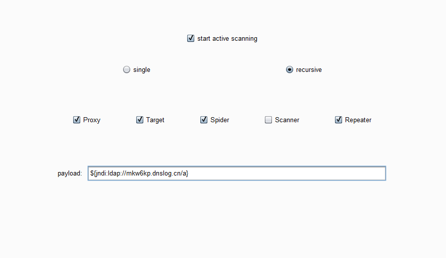

# log4j2_Pscan

 log4j2检测插件，可以递归测试请求中每个参数的burp插件

---

### 功能描述：

​	start active scanning：开启扫描

​	single：一次性测试，将payload添加到每个参数一次发送，只会请求一次

​	recursive：递归测试，将payload依次添加到每个参数，有几个参数发几次请求

​	第三排：设置从哪些模块监听请求

​	payload：进行测试的payload

### 插件截图：

​	
